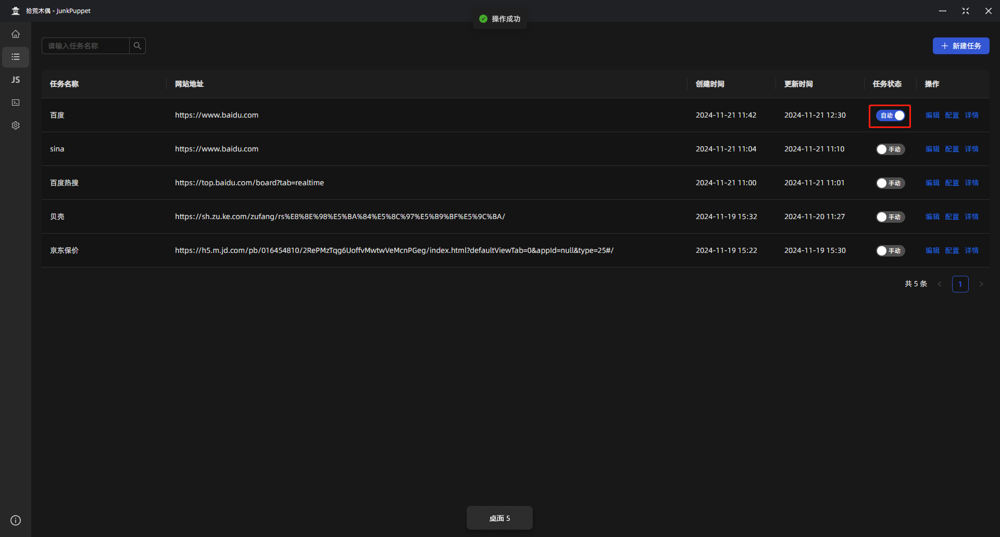
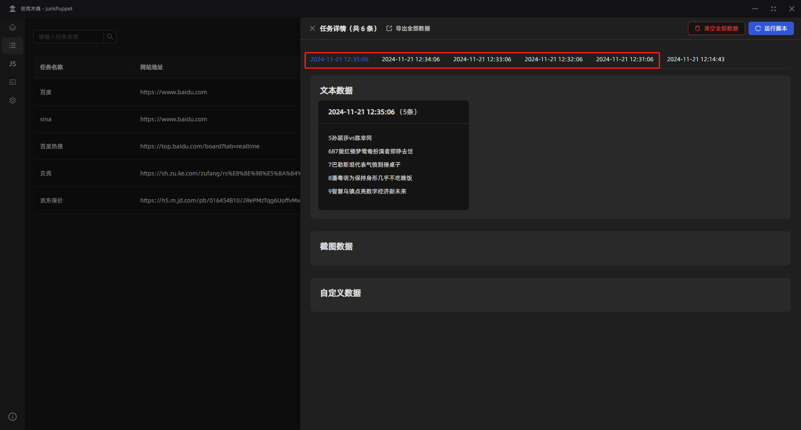

# 自动任务

## 编辑任务

## 打开自动任务
打开自动任务开关，并且填写cron表达式。

关于cron表达式，可以参考[在线Cron表达式生成器](https://cron.qqe2.com/)

::: warning 注意
请注意，cron表达式中不要出现 `?`， 应该将 `?` 换成 `*`
:::

下图 `0 * * * * *` 表达每分钟的第0秒执行

提交完成之后，任务状态会变为 `自动`

## 自动执行

每分钟自动执行

