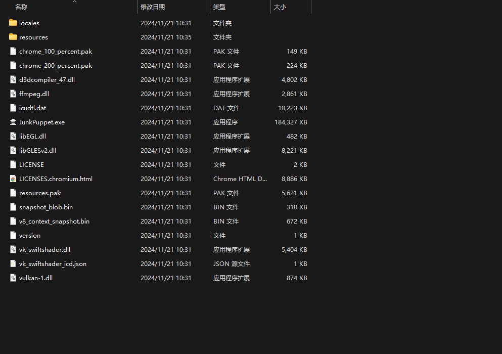
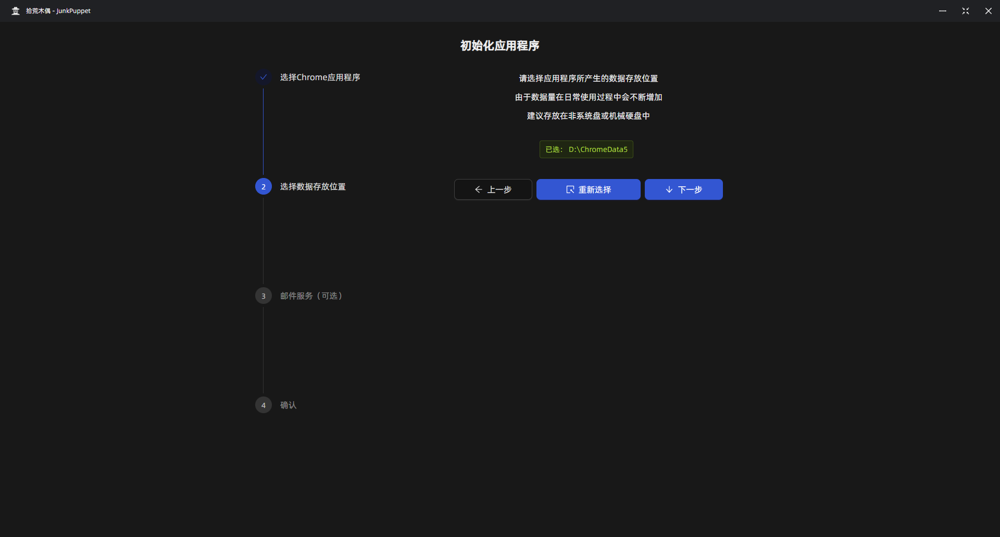

# 初始化你的应用程序

## 首先解压压缩包
将下载下来的压缩包使用解压软件进行解压（可以通过 [7-zip](https://www.7-zip.org/) 进行解压）

## 打开软件
在你解压完成的文件夹里面找到JunkPuppet.exe文件并打开

## 设置浏览器
你需要选择木偶可以操作的浏览器，比如 [Chrome](https://www.google.cn/chrome/index.html) (推荐) 或者 windows自带的 `Microsoft Edge`

::: tip 查看Chrome位置

:::
::: warning 查看Edge位置

:::
## 选择数据存放位置
选择一个文件夹存放拾荒木偶所产生的所有数据

## 二次确认
再次确认你的设置是否正确，点击确定之后，软件将会重启以加载你的配置
