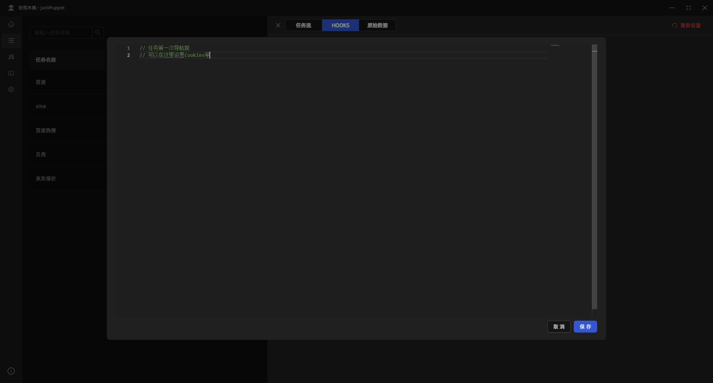
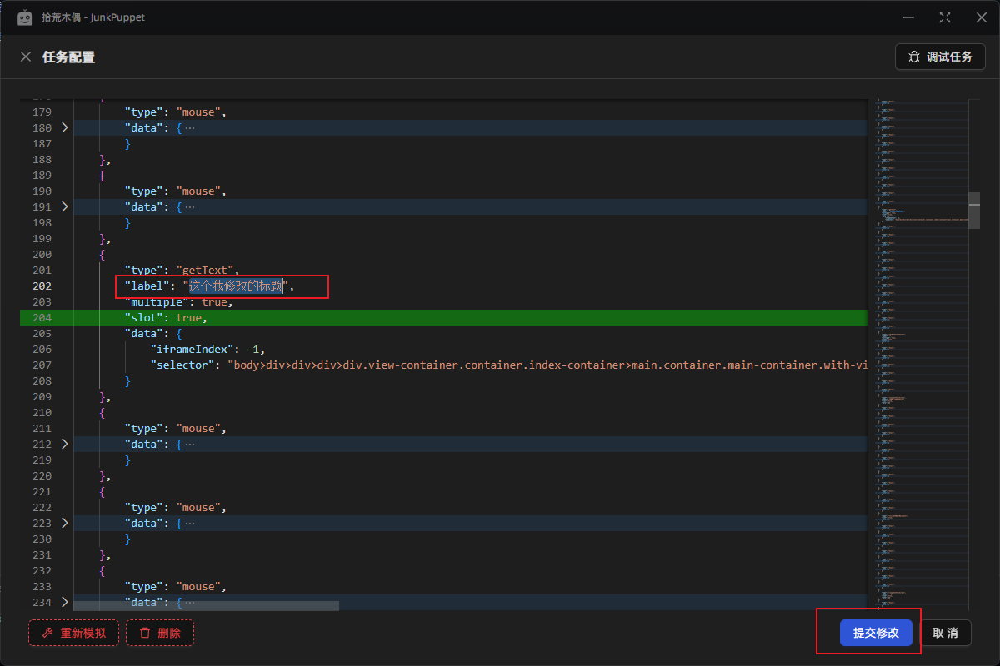
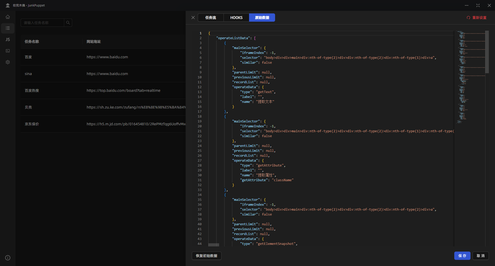
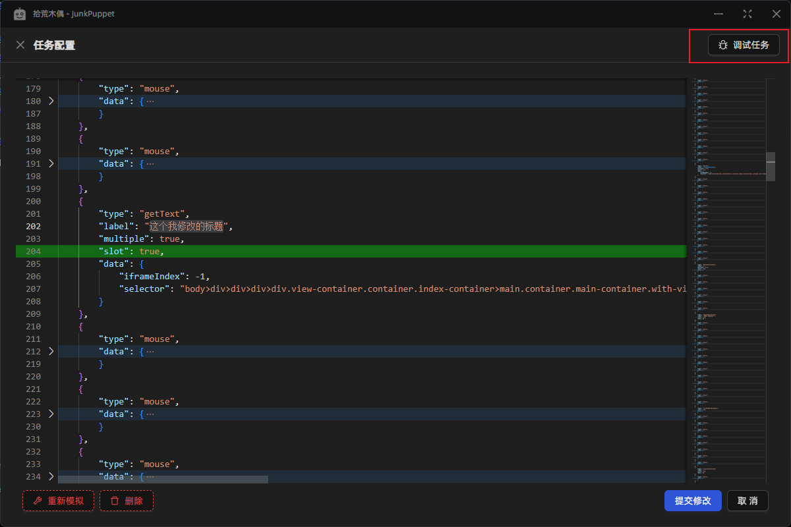
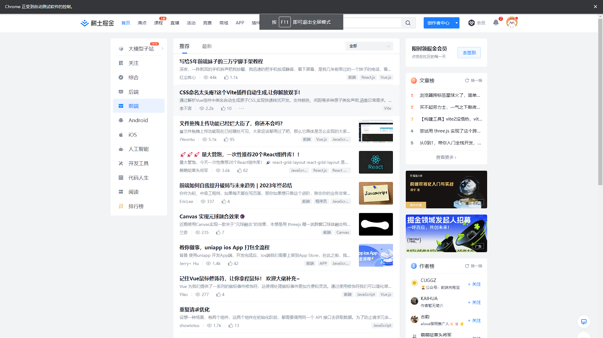

# 调试任务

## 格式你的配置文件

点击编辑，即可格式你的配置文件，它是一个 JSON 格式

## 修改你的配置文件

比如，这里修改了一个提取文本操作的标题，点击提交即可修改成功

## 重新模拟

左下角的 `重新模拟` 可以丢弃当前的配置文件（建议先备份），重新模拟你的操作

## 调试你的任务

点击右上角的调试任务

会自动弹出浏览器窗口，然后木偶将会重现你的所有操作

你就可以查看是哪一步错了问题

