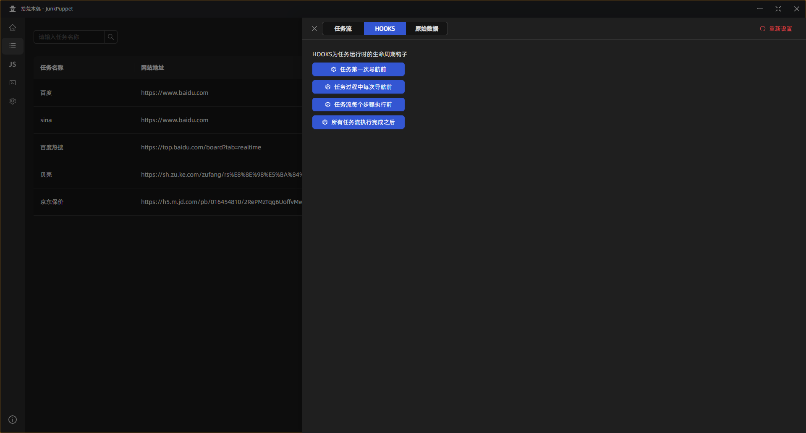

# 任务流配置

任务流配置包括 `任务流`、`HOOKS`、`原始数据`

## 任务流

只需点击操作流程中的每一个步骤，便能随即开启与之对应的配置弹窗。在弹出的窗口内，用户可以便捷地修改相关联的各项配置参数，完成修改后，点击保存按钮即可使新的配置生效，整个操作过程简洁流畅，易于上手，有效提升了用户对软件配置的精细化管理能力与操作效率。

## HOOKS

HOOKS 作为任务运行时的生命周期钩子，为用户提供了强大的任务控制能力。在任务执行的进程中，您能够在任意所需的关键位置灵活插入自行定制的代码片段。借助这一特性，您可深度介入任务执行流程，实现对任务运行状态的精准掌控与个性化定制，使其完全贴合您的特定业务需求与操作逻辑，极大地拓展了任务执行的灵活性与自主性，为您打造专属的任务执行方案。

## 原始数据

在此处，用户能够直接对配置的原始数据以 JSON 格式进行编辑操作。这种编辑方式不仅高效便捷，可快速定位与修改数据内容，而且 JSON 格式自身所具备的高度灵活性，允许用户根据不同的任务需求与场景变化，自由地调整数据结构与参数值，从而为用户提供了一种精准且极具适应性的配置编辑途径，有力地提升了软件配置的多样性与可扩展性。

