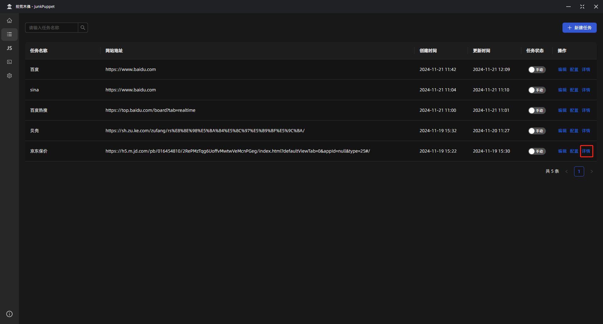

# 运行任务

## 打开详情

我们返回任务列表，点击 `详情`。

打开任务运行详情。此时我们还没有运行过该任务，所以任务详情是空。

## 运行任务

点击右上角的 `运行任务`

稍等片刻，任务即可执行完成，全程无感知。

> 执行过程中，任务详情的弹窗可以关闭掉，对任务执行没有影响

## 查看结果

任务执行完成后，即可查看执行结果。

第一项为文本数据，第一个卡片中为文章列表中的每一篇文章标题，第二个卡片为第一篇文章的文章内容

