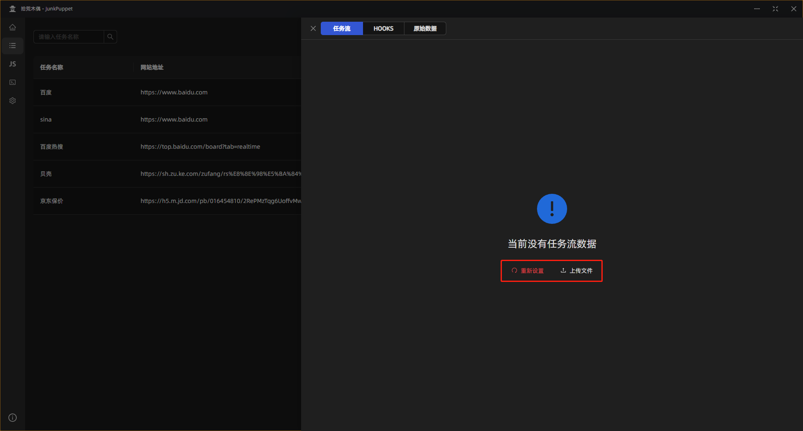
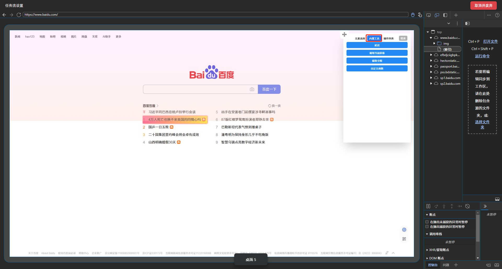

# 配置任务

在上一步中我们已经新建了一个任务，接下来就是配置这个任务应该怎么运行，点击配置进入任务配置

## 开始模拟

由于当前任务是新建的，所以没有模拟数据，接下来就应该去模拟操作了，点击 `开始模拟`

## 打开浏览器

点击 `开始模拟`，会自动打开一个浏览器窗口，然后，重点来了！

::: danger 请务必关闭上方的的这个 Tip
:::
::: danger 请务必关闭上方的的这个 Tip
:::
::: danger 请务必关闭上方的的这个 Tip
:::

每个被打开的页面都会内嵌一个工具箱，就在右下角，鼠标放上去就会展开工具

## 提取文章列表文本

首先，我们开启工具栏的`选择相似`功能（下图中标1），这个功能可以在你选择一个元素时，同时找出和这个元素结构相似的元素。

然后点击`提取文本`那个按钮（下图中标2）

然后鼠标移到你需要提取文本的元素上，每次鼠标移动都会有一个`浅粉红色框`来标识你目前鼠标所触发的元素

然后按住 `shift + a`，即可选择这些元素，被选中提取文本的元素背景颜色会变成 `渐变色绿`

## 截取文章列表每一篇截图

接下来我们还需要截取列表中每篇文章的截图，找到工具箱中 `截取元素` 工具。

同理，鼠标移到你需要截取元素的元素上，每次鼠标移动都会有一个`浅粉红色框`来标识你目前鼠标所触发的元素

然后按住 `shift + a`，即可选择这些元素，被选中截取元素的元素背景颜色会变成 `渐变色蓝`

## 操作列表

随后找到工具箱中的 `操作列表`，会打开一个弹出框。

这里面是你所有已操作的列表，你可以对之前的操作做一些修改

## 内置工具（内置函数）

点击 `内置工具`（或者你可以叫它内置函数），会弹出一些内置好的功能。我们点击截取全屏幕。

这个操作可以截取整个页面（包括你可以滚动的地方）

同时这个操作会被添加到你的操作列表

点击`编辑`，可以给这个截图起一个名字

## 跳转至第一篇文章

接下来，我们需要进去到第一篇文章中，获取文章中的内容，同时截取文章截图

找到工具箱中的 `点击跳转`，因为打开第一篇文章会有加载动作（HTTP请求），所以需要点击跳转功能

同理，鼠标移到你需要点击跳转的元素上，每次鼠标移动都会有一个`浅粉红色框`来标识你目前鼠标所触发的元素

然后按住 `shift + a`，即可选择这个元素（其实就是用鼠标点击了一下这个元素）。同时页面会发生跳转。

> 解释一下：你正常浏览这个网站，并且鼠标点击这个元素会发生什么，这个时候就会发生什么。

这个时候我们已经跳转过来了，等页面加载完成（当工具箱这个按钮出现就说明页面加载完成了）。

现在要获取文章内容了，我们选择 `提取文本` 功能，并且选择一个比较大的范围

然后按 `shift + a` 即可选择文本

## 截取第一篇文章文章内容截图

还需要截取文章截图，这里选择 `内置工具` 中的 `截取全屏幕`

最后，找到工具箱中的 `结束` ，即可完成本次设置。

## 结束

结束后，浏览器窗口会关闭，回到主应用界面。此时配置信息已经被保存下来了。

## 下一步

下一步，运行任务。
