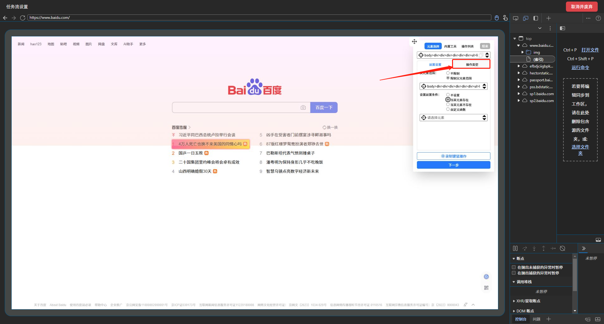
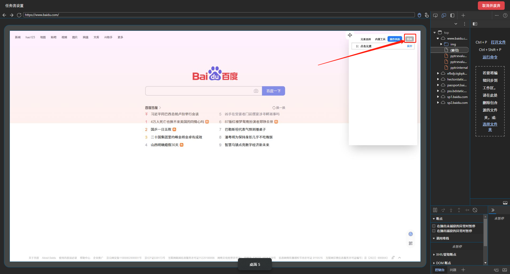

# 配置任务

在上一步中我们已经新建了一个任务，接下来就是配置这个任务应该怎么运行，点击配置进入任务配置

## 开始模拟

由于当前任务是新建的，所以没有模拟数据，接下来就应该去模拟操作了，点击 `模拟`。或者通过 [任务合集](/task/readme) 下载文件，然后点击上传文件导入配置即可

## 在页面中设置

点击 `模拟`，会自动打开一个设置窗口，每个被打开的页面都会内嵌一个工具箱,如图

首先我们每次操作的第一步就是点击如图的选择元素按钮，然后鼠标移动到目标元素，然后点击鼠标左键，即可完成元素的选择，被选择的元素会被高亮显示

在每次选择元素之前，我们先点击如多选图标，如图即可进行元素多选推导，会选择相似的元素，比如列表的每一项

## 选择元素

首先，我们开启工具栏的`选择相似`功能（下图），这个功能可以在你选择一个元素时，同时找出和这个元素结构相似的元素。

然后在点击选择元素的图标（下图）

即可完成元素推导多选，每个被选中的元素都会高亮显示

然后鼠标移到你需要提取文本的元素上，每次鼠标移动都会有一个`浅粉红色框`来标识你目前鼠标所触发的元素

## 设置前置条件或者限制父元素范围

## 选择给与元素的操作
点击操作类型

然后选择你需要操作的类型，比如 `点击元素`、`截取元素`、`输入文字`、`点击导航`等

然后点击下一步，即可完成本步的操作设置

## 关于点击导航

由于点击一些链接或者按钮时会进行页面导航，此时不能简单的通过 `点击元素` 进行操作，需使用 `点击导航` 进行跳转

## 录制键鼠操作（可选）

点击录制键鼠操作之后，会录制你的键盘和鼠标操作记录，在执行时会先执行键鼠操作，然后再执行元素操作

## 内置工具

点击内置工具，可选择工具自带的功能，比如截取当前图、截取全图、延迟等待、自定义函数等

## 操作列表

点击操作列表可查看你的所有操作

## 结束

点击工具中的 `结束` 即可保存本次的配置

如果本次设置的不满意，可点击右上角的 `取消并废弃` 废弃本次设置

随后回到主应用界面。此时配置信息已经被保存下来了。

